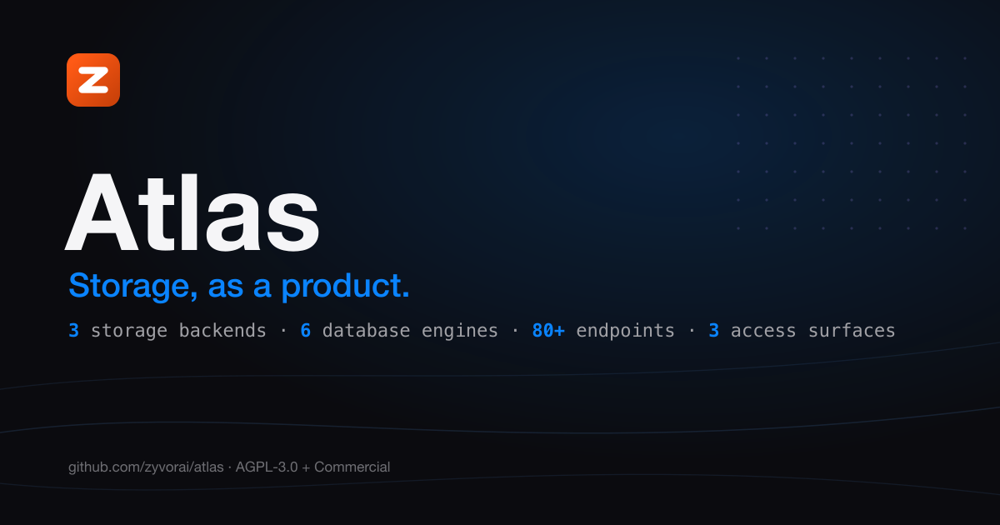
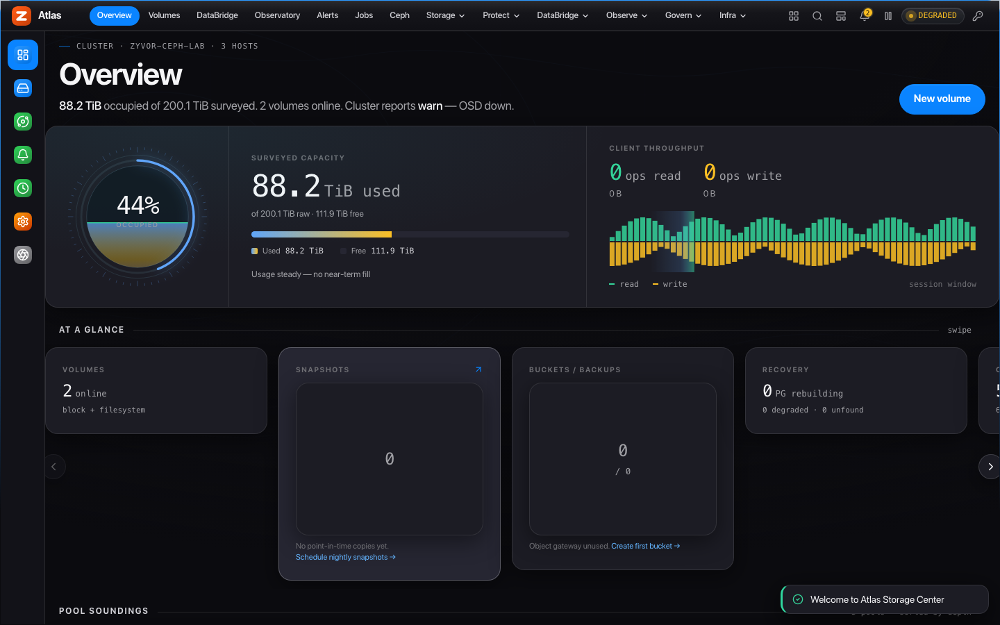
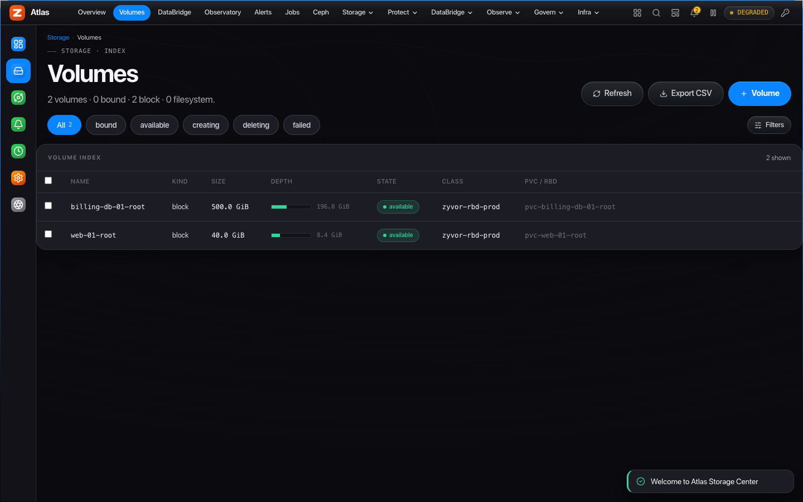
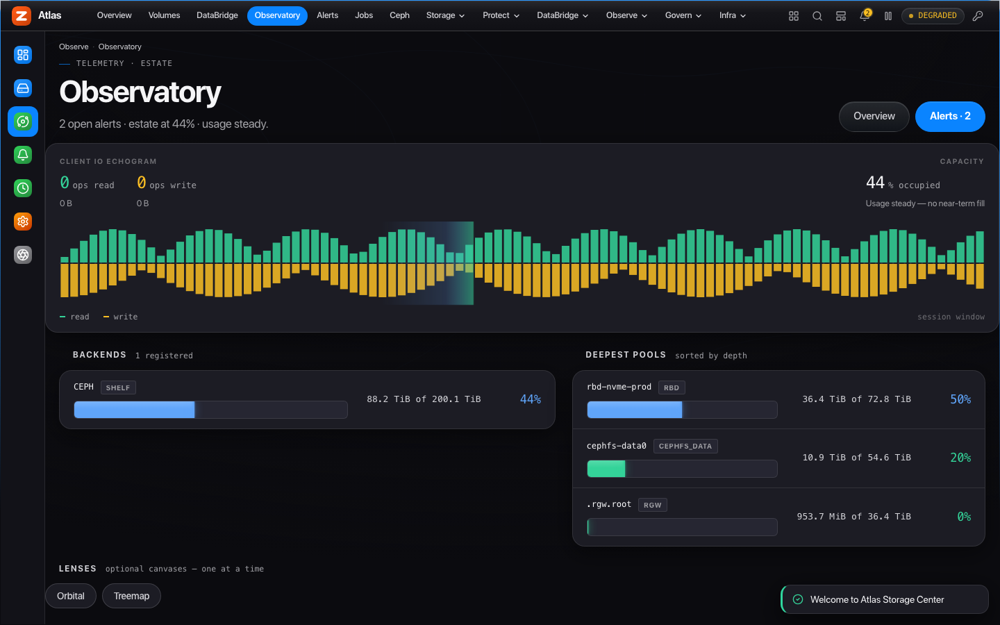
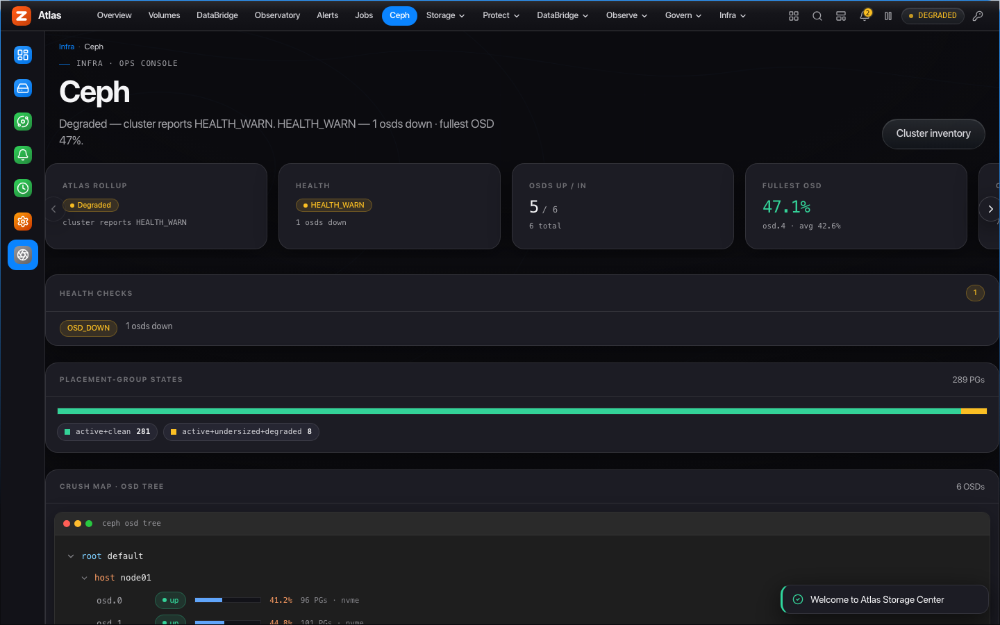
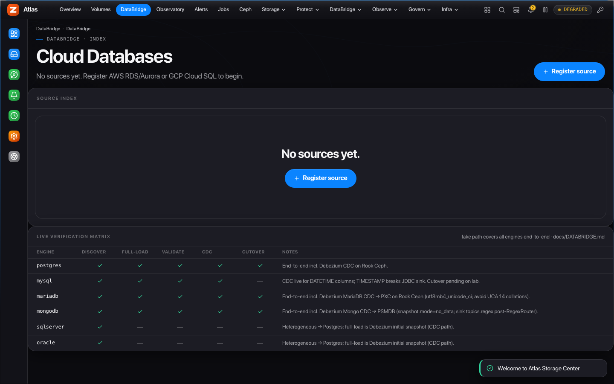
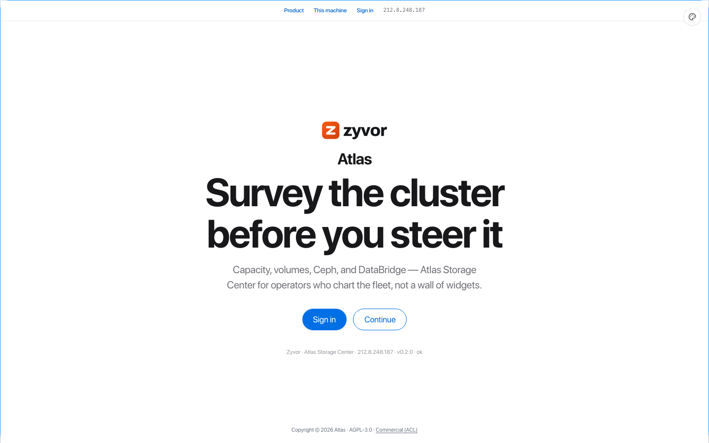
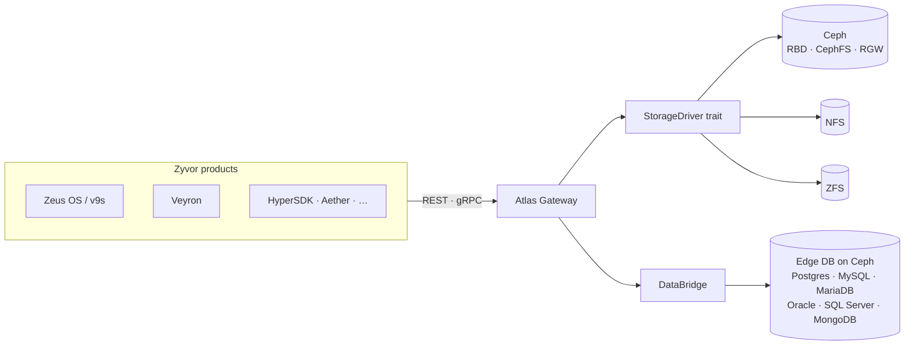

<!-- Copyright (c) 2026 ZyvorAI Labs Private Limited. -->
<!-- SPDX-License-Identifier: LicenseRef-Zyvor-Production-1.0 -->
# Atlas

[](https://github.com/zyvorai/atlas/actions/workflows/ci.yml)
[](LICENSE)
[](CHANGELOG.md)
[](https://zyvorai.github.io/atlas/)




**Storage, as a product.** Atlas is the **central storage control plane** for the Zyvor
suite. Products call stable Atlas APIs; Atlas maps intent to Ceph (and NFS/ZFS) through
pluggable drivers — with an Apple Shop console for operators.

**3** storage backends · **6** database engines migratable via DataBridge · **80+** REST
endpoints · **3** access surfaces (REST · gRPC · SSE)

📖 **[Read the full docs](https://zyvorai.github.io/atlas/)** — quickstart, architecture, licensing.



## Contents

- [Quickstart](#-quickstart)
- [Dashboard gallery](#-dashboard-gallery)
- [Architecture at a glance](#-architecture-at-a-glance)
- [Capabilities](#-capabilities)
- [Why Atlas](#-why-atlas)
- [Important boundaries](#-important-boundaries)
- [License](#-license)

## 🚀 Quickstart

```bash
make run
# Console → http://127.0.0.1:5110
cargo run -p atlas-cli -- --base-url http://127.0.0.1:5110 health
```

No Ceph cluster needed to try it — `make run` starts the gateway against a fake driver so
you can click through the whole console immediately.

Deploy to a remote k3s host:

```bash
./scripts/deploy-remote.sh <host> <user>
# UI → http://<host>:30510
```

| Track | Where |
| --- | --- |
| **Non-production use** (free under the Zyvor Production License) | This repo |
| **Production / commercial license** | [https://zyvor.dev](https://zyvor.dev) |
| **Docs site** | https://zyvorai.github.io/atlas/ |

More: [docs/GETTING_STARTED.md](docs/GETTING_STARTED.md) · [docs/DEPLOYMENT.md](docs/DEPLOYMENT.md) · [docs/ARCHITECTURE.md](docs/ARCHITECTURE.md).

## 🖥 Dashboard gallery

Live console shots (captured against a lab deployment):

| | | |
|---|---|---|
|  |  |  |
|  |  |  |

Full tour: [Gallery](https://zyvorai.github.io/atlas/gallery).

## 🗺 Architecture at a glance



Full write-up: [docs/ARCHITECTURE.md](docs/ARCHITECTURE.md).

## 🧰 Capabilities

- **Intent → storage** — volumes, snapshots, clones, CephFS RWX, RGW buckets via REST + gRPC
- **Pluggable drivers** — real Ceph first; NFS + ZFS; fake driver for local demo
- **DataBridge** — cloud-to-edge DB migration (six engines, CDC, cutover) on Ceph
- **Day-2** — alerts, maintenance, governance, quotas, upgrade preflight, DR scaffolding
- **Ops Advisor** — explainable AI-assisted risk scoring and prioritized, read-only runbooks
- **Console** — Apple.com-style top-nav shell, SF type, Night/Day themes

Customer-facing feature guide: [docs/atlas-customer-feature-guide.md](docs/atlas-customer-feature-guide.md).

## ⚖ Why Atlas

| | Atlas | Raw Ceph tooling | Rook alone |
|---|---|---|---|
| Intent-based API (not pool internals) | Yes | No | No |
| One API across Ceph + NFS + ZFS | Yes | Ceph only | Ceph only |
| Cloud-to-edge DB migration (DataBridge) | Yes | No | No |
| Per-tenant quotas & governance | Yes | Partial | No |
| Built-in operator console | Yes | Ceph Dashboard only | No |
| Kubernetes-native provisioning | Yes (via drivers) | No | Yes |

## 🔍 Important boundaries

What's free under the Zyvor Production License vs. what needs a commercial license
([full guide](docs/LICENSING.md)):

| Use case | Allowed without a paid license? |
| --- | --- |
| Development, testing, evaluation, research, education | Yes |
| Non-production laboratory and proof-of-concept use | Yes |
| Production environments and customer workloads | No — needs a commercial license |
| SaaS, managed services, OEM, appliances | No — needs a commercial license |
| Redistribution or resale | No — needs written permission and a commercial license |

## 📈 Star History

[](https://star-history.com/#zyvorai/atlas&Date)

## 📄 License

Licensed under the **[Zyvor Production License v1.0](LICENSE)**.

- **Free** for development, testing, evaluation, research, education, and non-production labs
- **Paid commercial license required** for production, customer workloads, SaaS, managed services, OEM, redistribution, and other revenue-generating use

Commercial terms are issued separately: [https://zyvor.dev](https://zyvor.dev). See [docs/LICENSING.md](docs/LICENSING.md). Contributions: [CLA.md](CLA.md) + [DCO.md](DCO.md) (`git commit -s`),
governed by our [Code of Conduct](CODE_OF_CONDUCT.md).
