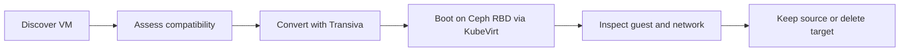

<!-- Copyright (c) 2026 ZyvorAI Labs Private Limited. -->
<!-- SPDX-License-Identifier: LicenseRef-Zyvor-Production-1.0 -->
# 30-minute VMware exit demonstration

This is a presenter script, not a claim that Atlas imports disks. One Windows or Linux VM is discovered, scored, converted, and booted on a Ceph RBD StorageClass. The source VM is not modified. If validation fails, delete the target VM.

Atlas does **not** stream the converted image into RBD. There is no `image.import` job, no resume offset, and no block checksum recorded by Atlas. Saying otherwise is a false demo. Direct import is later Migration Assurance work.

Budget about 30 minutes. Stop at the step that fails rather than skipping ahead and narrating a result you did not produce.

## What the audience should see



The boot step uses CDI and the existing StorageClass. It is not an Atlas write.

## Before you start

- A Scout binary built from the Scout repo (`make build`).
- An RVTools `.xlsx` export for the lab VM, already on the presenter laptop. Do not upload it.
- GuestKit and Transiva available locally.
- A cluster with KubeVirt, CDI, and the `zyvor-rbd-prod` StorageClass from [deploy/rook-ceph-lab/07-sample-kubevirt-vm.yaml](../deploy/rook-ceph-lab/07-sample-kubevirt-vm.yaml).
- Zeus, if you will show the console. PacketWolf only if that cluster already runs it.

## 0–5 min — Discover

```bash
./bin/scout import --rvtools RVTools.xlsx --out scout.json
./bin/scout report --file scout.json --executive executive.html --pdf executive.pdf
```

Show the VM, its disks, and any aged snapshots. If the guest is Windows, read the VirtIO finding out loud: RVTools does not contain driver evidence, so the guest is Review until GuestKit inspects the disk.

## 5–10 min — Inspect the offline disk

After Transiva has a qcow2, or on a disk you already converted in rehearsal:

```bash
guestkit inspect vm.qcow2 --profile migration
```

This is the GuestKit step. Do not claim VirtIO readiness from the RVTools file.

## 10–18 min — Convert

```bash
hyperconvert --source vm-disk.vmdk --target-format qcow2
```

Transiva writes qcow2. It does not write an Atlas-managed RBD image.

## 18–25 min — Boot on the Ceph StorageClass

Start from [deploy/rook-ceph-lab/07-sample-kubevirt-vm.yaml](../deploy/rook-ceph-lab/07-sample-kubevirt-vm.yaml). That manifest creates a DataVolume on `zyvor-rbd-prod` and a VirtualMachine.

Point `spec.source` at the converted qcow2 (CDI HTTP or upload). The sample's Ubuntu cloud-image URL is only a StorageClass boot check. If you leave that URL in place, say so: the VM that boots is not the converted customer disk.

Apply the manifest. Wait until the DataVolume is succeeded and the VirtualMachine is running. Open it in Zeus.

Tell the room: Atlas did not copy the blocks. CDI wrote the disk to a Ceph RBD volume because the StorageClass is Ceph-backed.

## 25–28 min — Check

- Zeus: the guest reached a login prompt or cloud-init finished.
- GuestKit: re-run inspect only if the boot failed and you need the repair plan. Do not repair the source VM.
- PacketWolf: show the flow only when the lab already collects it. If it does not, skip the step and say the network check was not run.

## 28–30 min — Roll back

The source VM was never powered off or converted in place.

Delete the target VirtualMachine and its DataVolume. That is the rollback. There is no Atlas recovery point to promote, because Atlas did not import the disk.

## What not to say

- Do not say the image was written by Atlas, resumed after a failure, or checksummed by Atlas.
- Do not say the last DR drill passed. Two-site RBD mirroring is still unverified. See [DR.md](DR.md).
- Do not quote a savings percent. If someone asks about cost, use their cores, renewal, storage, support, and migration figures.
